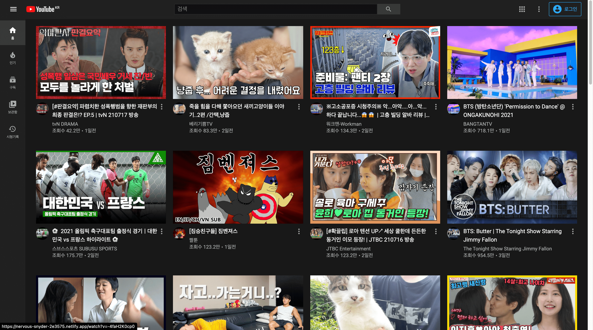
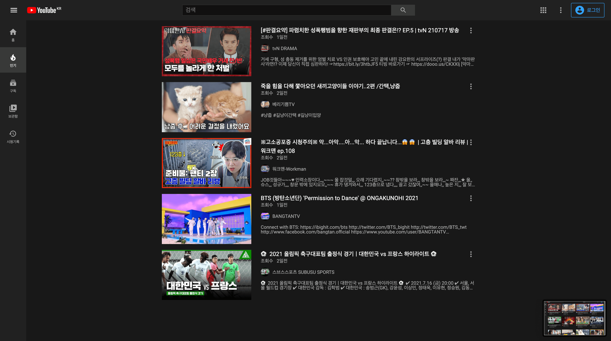
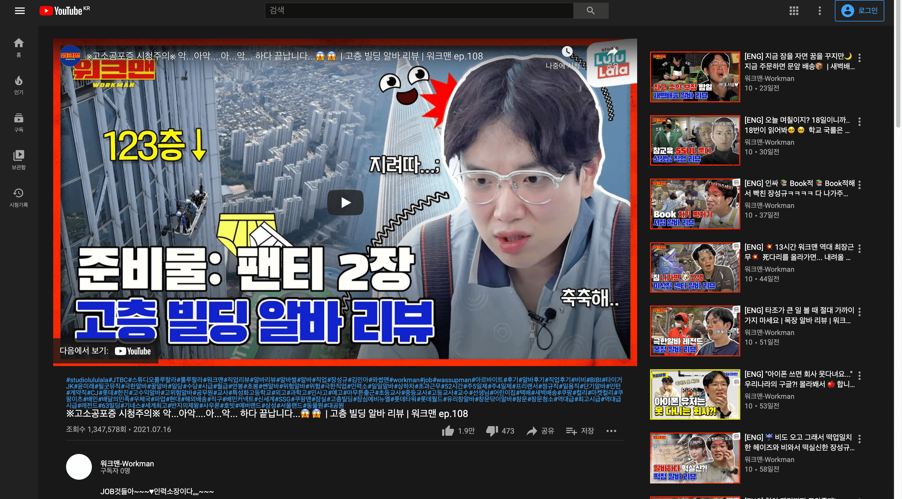
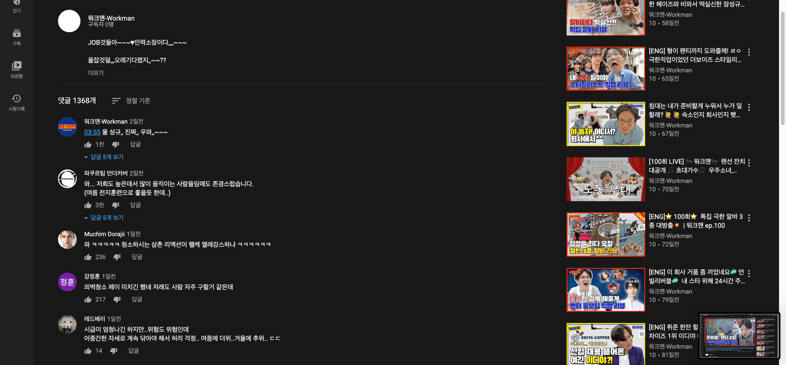
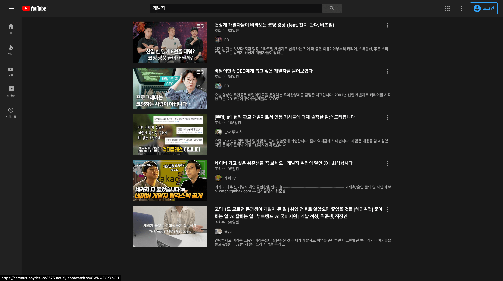

# Youtube Clone

## 데모
https://nervous-snyder-2e3575.netlify.app/

## 프로젝트 구성안내
### 목표
- 유튜브API를 활용해서 유튜브 사이트처럼 만들어보자!
### 간단한 기술 스택
- react, redux
- redux-saga (리덕스 미들웨어, 외부통신)
- react-google-login (구글로그인)
- styled-components (스타일)
- netlify (배포)

## 폴더트리 구조
```text
.
├── package.json
├── src
│   ├── api
│   ├── constants
│   ├── hooks
│   ├── images
│   ├── index.js
│   ├── lib
│   │   ├── Common.js
│   │   ├── Fetch.js
│   │   ├── History.js
│   │   ├── Hooks.js
│   │   └── Validation.js
│   ├── redux
│   │   ├── ActionCreators.js
│   │   ├── app
│   │   │   ├── redux.js
│   │   │   └── saga.js
│   │   ├── auth
│   │   │   ├── redux.js
│   │   │   └── saga.js
│   │   ├── reducer.js
│   │   ├── saga.js
│   │   ├── search
│   │   │   ├── redux.js
│   │   │   └── saga.js
│   │   ├── store.js
│   │   └── video
│   │       ├── redux.js
│   │       └── saga.js
│   ├── styled
│   │   ├── Common.Styled.js
│   │   ├── Reset.Styled.js
│   │   ├── Responsive.Styled.js
│   │   ├── Util.Styled.js
│   │   └── variable.js
│   └── view
│       ├── App.js
│       ├── Containers
│       │   ├── FeedContainer
│       │   ├── LoadedContainer
│       │   ├── SearchContainer
│       │   ├── VideoListContainer
│       │   └── WatchContainer
│       ├── components
│       │   ├── Button
│       │   ├── Common
│       │   ├── Header
│       │   ├── Icons
│       │   ├── Layout
│       │   ├── Player
│       │   ├── SearchBox
│       │   ├── SideMenu
│       │   ├── Skeleton
│       │   ├── Video
│       │   └── Watch
│       ├── pages
│       │   ├── Feed
│       │   │   ├── Best
│       │   │   ├── History
│       │   │   ├── Library
│       │   │   ├── Subscriptions
│       │   │   └── index.js
│       │   ├── Home
│       │   ├── Results
│       │   ├── Searrch
│       │   ├── Sign
│       │   │   ├── SignIn.js
│       │   │   └── SignUp.js
│       │   └── Watch
│       └── routes
│           └── Routes.js
```
- container에서 props를 가져와서 하위 컴포넌트들에게 필요한 Props를 전달하는 식으로 만들었습니다.

## 프로젝트 설치방법
```shell
# 프로젝트 설치
yarn
```

## 프로젝트 사용법
```shell
# 프로젝트 시작
yarn start
```

## 프로젝트 기능설명
### 메인페이지

- 메인 페이지 입니다.
- 인기있는 동영상을 youtube API로 가져와서 출력했습니다.
- 보고싶은 동영상을 클릭하시면 동영상 플레이어 페이지로 이동합니다.
- IntersectionObserver를 활용해서 무한스크롤을 구현했습니다.
- 상단 검색바로 동영상 검색 가능합니다.
### 인기동영상 페이지

- 인기 동영상 페이지 입니다.
- 무료 API를 사용중이라 용량제한때문에 5개만 불러오도록 했습니다.
- 보고싶은 동영상을 클릭하시면 동영상 플레이어 페이지로 이동합니다.
- 상단 검색바로 동영상 검색 가능합니다.
### 동영상 플레이어


- 동영상 상제 페이지 입니다.
- 동영상 플레이어, 태그, 영상소개, 관련영상, 댓글, 답글, 좋아요 갯수까지 구현 되어있습니다.
- 보고싶은 동영상을 클릭하시면 해당 동영상 플레이어 페이지로 이동합니다. 
### 검색 페이지

- 상단 검색바를 통해 검색을 하면 나오는 검색 페이지입니다.
- 무료 API를 사용중이라 용량제한때문에 5개만 불러오도록 했습니다.
- 보고싶은 동영상을 클릭하시면 해당 동영상 플레이어 페이지로 이동합니다.


## 프로젝트 만들면서..
https://bereal1995.github.io/sideproject/youtube-clone/

### IntersectionObserver
```javascript
export const createObserver = (sentinelCurrent, callMoreItems = () => {}) => {
    let observer = new IntersectionObserver((entries, observer) => {
        entries.forEach(entry => {
            if(entry.isIntersecting) {
                callMoreItems && callMoreItems()
            }
        });
    });

    return observer.observe(sentinelCurrent);
}
```
- 무한 스크롤을 구현할때 썼던 함수 입니다.
- createObserver(돔, 콜백) 함수에 첫번째 인자에 돔을 넣어주고 두번째 인자에 콜백 함수를 넣어 줍니다.
- 돔이 발견되는 순간 콜백 함수가 실행됩니다.

## 저작권 및 사용자 정보
© 2021 HH gygud98@gmail.com  
### youtube api 참고
- https://developers.google.com/youtube/v3/getting-started?hl=ko


## 프로그램 작성자
- https://github.com/bereal1995

## 버전
### 1.0.0 (2021. 03. 04)
- 첫번째 출시